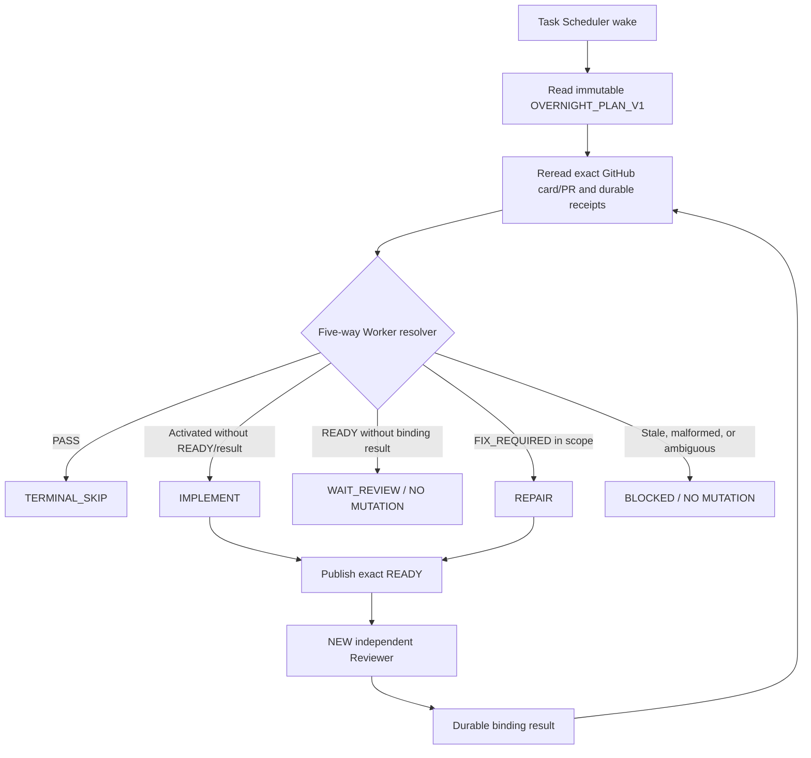

# GPT Browser Bridge — V10.6 Architecture Pointer

This is the concise, stable architecture pointer for the V10.6 Pull-first
baseline. The accepted architecture authority is GBB Issue #43, receipt
`5240794427` (`V10_6_FEASIBILITY_DUAL_EXTERNAL_REVIEW_RECONCILIATION_V1`).
Current card, READY, review-result, and head state remain on the exact GitHub
Issue/PR; this document does not freeze mutable task state.

## Minimal components and boundaries

- `OVERNIGHT_PLAN_V1` is an immutable ordered work menu for one bounded run.
- Windows Task Scheduler wakes a single Worker or independent Reviewer dispatcher.
- Each executor rereads the exact GitHub card/PR and durable receipts before acting.
- The Worker implements only the assigned card and publishes an exact READY.
- A NEW independent Reviewer reads that READY and publishes its own binding
  `PASS`, `FIX_REQUIRED`, or `BLOCKED` result.
- Control handles activation, dependency exceptions, and transport decisions; it
  never replaces the Worker or formal Reviewer.

## Non-negotiable flow rules

1. Exact card/PR receipts, not a wake prompt or static documentation, decide
   current legal work.
2. `READY` without a current formal result is `WAIT_REVIEW`; it cannot mutate
   files or advance a successor.
3. Formal review identity binds `review_request_id`, `source_ready_receipt_id`,
   and `reviewed_head_sha`; a newer READY supersedes an older result.
4. Normal scheduled execution uses the operating system's single-instance
   behavior. No new orchestrator, Projects/Push/Doorbell critical path,
   heartbeat/token service, multi-host layer, or autonomous backlog claiming is
   introduced by V10.6.
5. Merge and release remain outside Worker and Reviewer authority.

The pre-existing `docs/ARCHITECTURE.md` is left untouched as historical GBB-001
environment and skill-loading context; it is not the source of current card
state.
